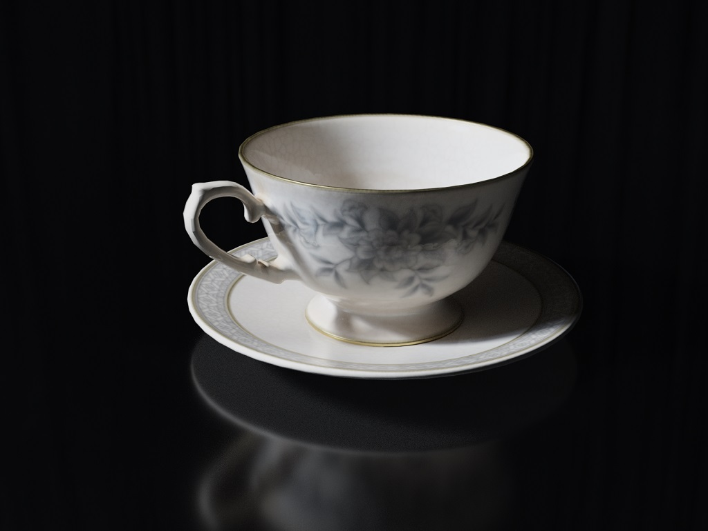
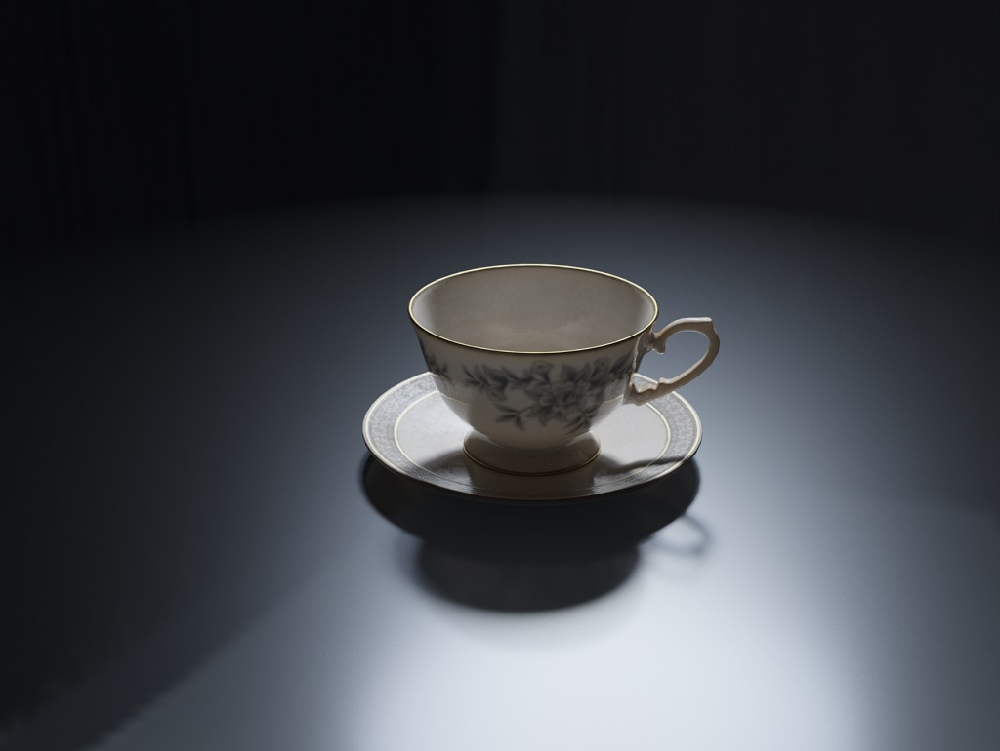
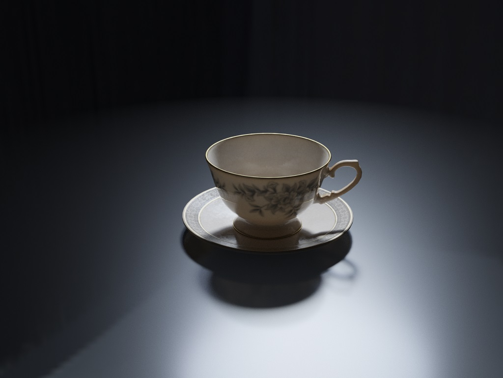
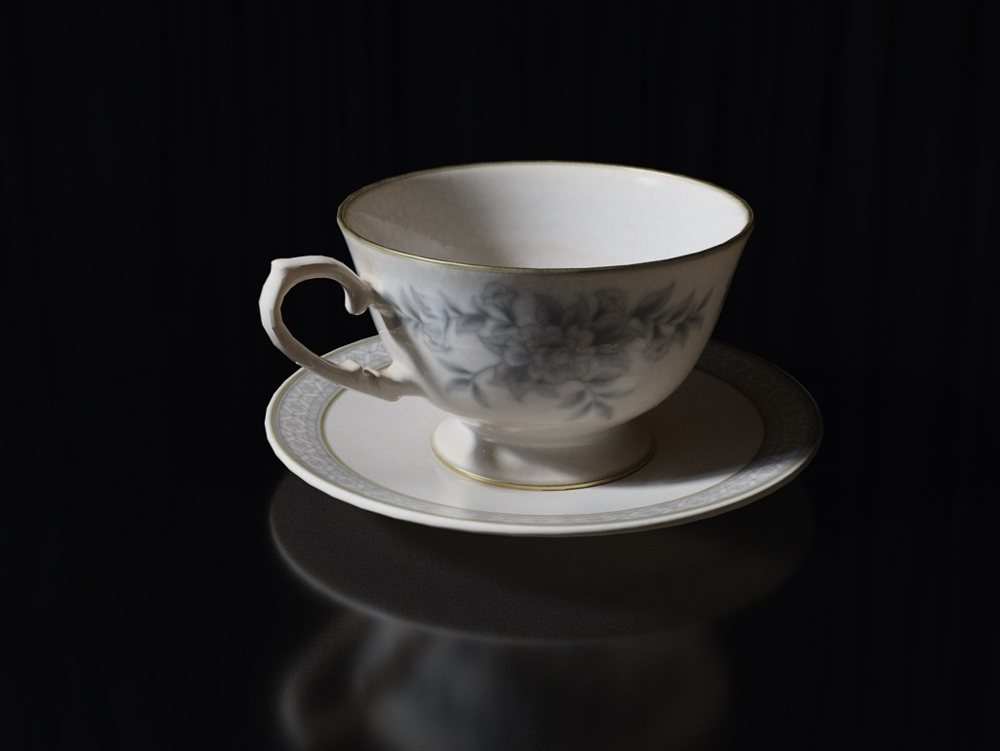
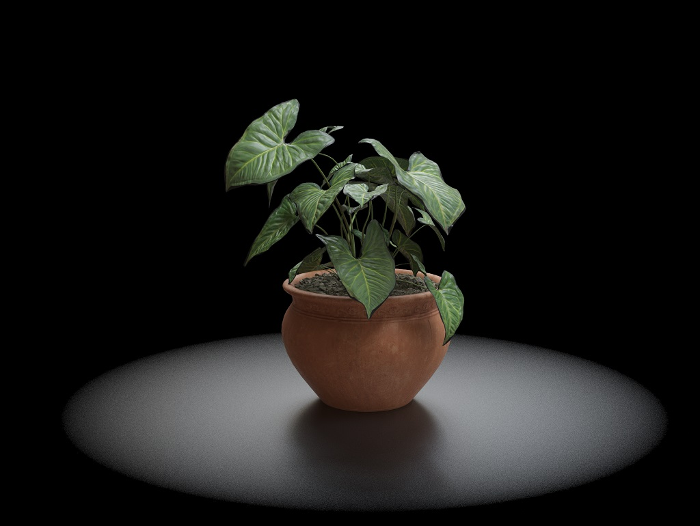
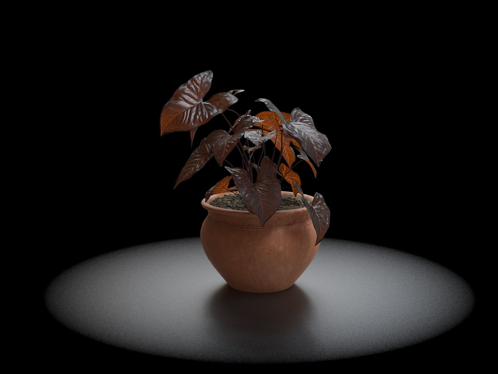

# KHR\_materials\_diffuse_transmission

## Contributors

* Tobias Haeussler, Dassault Systèmes [@proog128](https://github.com/proog128)
* Bastian Sdorra, Dassault Systèmes [@bsdorra](https://github.com/bsdorra)
* Ed Mackey, AGI [@emackey](https://twitter.com/emackey)

TODO
## Acknowledgments

TODO

## Status

Experimental

## Dependencies

Written against the glTF 2.0 spec.

## Overview

This extension adds a Lambertian diffuse transmission BSDF to the metallic-roughness material. Thin, dielectric objects like leaves or paper diffusely transmit incoming light to the opposite side of the surface. For optically thick media (volumes) with short scattering distances and therefore dense scattering behavior, a diffuse transmission lobe is a phenomenological plausible and cheap approximation.

<figure style="text-align:center">
<p float="left">


</p>
<sub><figcaption><em>(Thin) translucent leaves/foliage</em></figcaption></sub>
</figure>

## Extending Materials

The effect is activated by adding the `KHR_materials_diffuse_transmission` extension to any glTF material.

```json
{
    "materials": [
        {
            "extensions": {
                "KHR_materials_diffuse_transmission": {
                    "diffuseTransmissionFactor": 0.25,
                    "diffuseTransmissionTexture": {
                      "index": 0,
                    }
                    "diffuseTransmissionColorFactor": [
                      1.0,
                      0.9,
                      0.85
                    ]
                }
            }
        }
    ]
}
```

|                                     | Type                                                                | Description                                                                                                                                                                                         | Required                 |
| ----------------------------------- | ------------------------------------------------------------------- | --------------------------------------------------------------------------------------------------------------------------------------------------------------------------------------------------- | ------------------------ |
| **diffuseTransmissionFactor**       | `number`                                                            | The percentage of reflected, non-specularly reflected light that is transmitted through the surface via the Lambertian diffuse transmission, i.e., the strength of the diffuse transmission effect. | No, default: `0`         |
| **diffuseTransmissionTexture**      | [`textureInfo`](/specification/2.0/README.md#reference-textureInfo) | A texture that defines the strength of the diffuse transmission effect, stored in the alpha (A) channel. Will be multiplied by the diffuseTransmissionFactor.                                       | No                       |
| **diffuseTransmissionColorFactor**  | `number[3]`                                                         | The color of the transmitted light.                                                                                                                                                                 | No, default: `[1, 1, 1]` |
| **diffuseTransmissionColorTexture** | [`textureInfo`](/specification/2.0/README.md#reference-textureInfo) | A texture that defines the color of the transmitted light, stored in the RGB channels and encoded in sRGB. This texture will be multiplied by diffuseTransmissionColorFactor.                       | No                       |


The strength of the effect is controlled by `diffuseTransmissionFactor` and `diffuseTransmissionTexture`, combined via multiplication to describe a single value.
```
diffuseTransmission = diffuseTransmissionFactor * diffuseTransmissionTexture.a
```
The color of the effect is controlled by `diffuseTransmissionColorFactor` and `diffuseTransmissionColorTexture`, combined via multiplication to describe a single color.
```
diffuseTransmissionColor = diffuseTransmissionColorFactor * diffuseTransmissionColorTexture.rgb
```
## Examples

The examples use `diffuseTransmissionColorTexture` from `baseColorTexture`.
|                                                               Backlit                                                               |                  Side                  |
| :---------------------------------------------------------------------------------------------------------------------------------: | :------------------------------------: |
|                                                                                            |  |
|                         <br><sub>`diffuseTransmissionFactor: : 0.25`</sub>                         |     <br><sub>`diffuseTransmissionFactor: : 0.25`</sub>      |
| <br><sub>`diffuseTransmissionFactor: 0.25`<br>`diffuseTransmissionColorFactor: [1.0,0.9,0.85]` | <br><sub>`diffuseTransmissionFactor: 0.25`<br>`diffuseTransmissionColorFactor: [1.0,0.9,0.85]`|

<sub>[Tea Set](https://polyhaven.com/a/tea_set_01) by [James Ray Cock](https://www.artstation.com/jamesray), Jurita Burger and [Rico Cilliers](https://www.artstation.com/ricocilliers) on [PolyHaven](https://polyhaven.com)</sub>

The tea cup renderings demonstrate the effect of `diffuseTransmissionFactor` and `diffuseTransmissionColorFactor`. A strong directional light is direct towards the viewer, casting a strong shadow on the visible side of the tea cup (left). Increasing the `diffuseTransmissionFactor` brightens the shadowed areas by allowing light to diffusely transmit through the surface of the cup (mid). Please note, that this extension only specifies how light will be diffusely transmitted at the surface (volume boundaries). In reality, when light penetrates such a dense volumetric medium, photons become subject to wavelength dependent absorption and scattering events. Since wavelength dependence implies a potential color shift, this extension also introduces a `diffuseTransmissionColorFactor` parameter to provide a simple but effective way to approximate color shifts due to absorption and scattering. The images in the bottom row demonstrate a subtle use of `diffuseTransmissionColorFactor` by pushing the color of the transmitted light into a warm yellow. The side view of the cup predominantly shows the light facing part of the cup. In the lit part we can hardly notice any difference between the configurations. There's a slight darkening if the highlight area, as with an increasing `diffuseTransmissionFactor` energy is taken away from the diffuse reflection. This effect is much more prominent in the next example.

||
| :-----------------------------: |
||
|<br><sub>`diffuseTransmissionFactor: : 0.5`<br>`diffuseTransmissionColorFactor: [1,0,0]`</sub> |
|<br><sub>`diffuseTransmissionFactor: : 1.0`<br>`diffuseTransmissionColorFactor: [1,0,0]`</sub> |

<sub>[Potted Plant](https://polyhaven.com/a/potted_plant_02) by [Rico Cilliers](https://www.artstation.com/ricocilliers) on [PolyHaven](https://polyhaven.com)</sub>

Increasing the `diffuseTransmissionFactor` takes energy from the diffuse reflection and transfers it to the diffuse transmission. In the images above this effect is clearly visible. The green appearance of the leaves is the product of front-lighting and diffuse reflections based on the `baseColorTexture`. With `diffuseTransmissionFactor` approaching `1.0`, the appearance changes to red, as a product of back-lighting and the `diffuseTransmissionColorFactor`. Specular reflections are untouched by this effect.

## Implementation

*This section is normative.*

This extension changes the `dielectric_brdf` defined in [Appendix B](../../../../specification/2.0/README.md#appendix-b-brdf-implementation)
```
dielectric_brdf =
  fresnel_mix(
    ior = 1.5,
    base = diffuse_brdf(color = baseColor),
    layer = specular_brdf(α = roughness ^ 2)
  )
```
 to the following:
```
dielectric_brdf =
  fresnel_mix(
    ior = 1.5,
    base = mix(
      diffuse_brdf(color = baseColor),
      diffuse_btdf(color = diffuseTransmissionColor),
      diffuseTransmission),
    layer = specular_brdf(α = roughness ^ 2)
  )
```
Increasing the strength of the diffuse transmission effect using the `diffuseTransmissionFactor` parameter takes away energy from the diffuse reflection BSDF and passes it to the diffuse transmission BSDF. The specular reflection BSDF and Fresnel weighting are not affected.

*This section is non-normative.*

With a simple Lambert BRDF model, `diffuse_brdf` and `diffuse_btdf` may be implemented as follows
```
function diffuse_brdf(color) {
  if (view and light on same hemisphere) {
    return (1/pi) * color
  } else {
    return 0
  }
}

function diffuse_btdf(color) {
  if (view and light on opposite hemispheres) {
    return (1/pi) * color
  } else {
    return 0
  }
}

function mix(bsdf0, bsdf1, factor) {
  return (1-factor) * bsdf0 + factor * bsdf1
}
```

<figure style="text-align:center">

<sub><figcaption><em>Left: Diffuse BRDF. Right: Diffuse BTDF.</em></figcaption></sub>
</figure>

## Combining Diffuse Transmission with other Extensions
### KHR_materials_transmission
Both `KHR_materials_diffuse_transmission` and `KHR_materials_transmission` replace the diffuse BRDF with a mix of diffuse BRDF and a BTDF that transmits light onto the opposite side of the surface. In case of `KHR_materials_transmission`, this is a microfacet BTDF that shares its roughness with the microfacet BRDF. In case of `KHR_materials_diffuse_transmission`, on the other hand, this is a diffuse BTDF.

Let's recall the `dielectric_brdf` for `KHR_materials_diffuse_transmission` as defined above
```
dielectric_brdf =
  fresnel_mix(
    ior = 1.5,
    base = mix(
      diffuse_brdf(color = baseColor),
      diffuse_btdf(color = diffuseTransmissionColor),
      diffuseTransmission,
    layer = specular_brdf(α = roughness ^ 2)
  )
```

and compare it to the `dielectric_brdf` defined in `KHR_materials_transmission`
```
dielectric_brdf =
  fresnel_mix(
    ior = 1.5,
    base = mix(
      diffuse_brdf(baseColor),
      specular_btdf(α = roughness^2) * baseColor,
      transmission),
    layer = specular_brdf(α = roughness^2)
  )
```

Since the diffuse BTDF does not have controls for roughness, the roughness parameter acts only on the reflective part of the surface. By decoupling the reflection and transmission parts it is possible to configure materials which have a smooth reflection and a diffuse transmission, as shown in image below (right).

<figure style="text-align:center">
<p float="left">
 
 
</p>
<sub><figcaption><em>Emissive sphere behind material sample. Left: Opaque diffuse. Middle: Rough transmission. Right: Diffuse transmission.</em></figcaption></sub>
</figure><br>

If `KHR_materials_transmission` is used in combination with `KHR_materials_diffuse_transmission`, the transmission effect overrides the diffuse transmission effect.

We can formalize this behavior by combining the two cases from above
```
dielectric_brdf =
  fresnel_mix(
    ior = 1.5,
    base = mix(
      diffuse_bsdf,
      specular_btdf(α = roughness^2) * baseColor,
      transmission),
    layer = specular_brdf(α = roughness^2)
  )

diffuse_bsdf = mix(
    diffuse_brdf(color = baseColor),
    diffuse_btdf(color = diffuseTransmissionColor),
    diffuseTransmission)
```

### KHR_materials_volume
If `KHR_materials_diffuse_transmission` is combined with `KHR_materials_volume`, a diffuse transmission BTDF describes the transmission of light through the volume boundary. The object becomes translucent. The roughness parameter only affects the reflection. Scattering and absorption inside the volume are computed as defined in `KHR_materials_volume` and `KHR_materials_sss`, so the random walk through the volume is not affected by the surface BSDF.

<figure style="text-align:center">

<sub><figcaption><em>Translucent sphere with varying roughness. From left to right: 0.0, 0.2, 0.4.</em></figcaption></sub>
</figure>

For comparison, below is the result for the same scene with `KHR_materials_transmission` instead of `KHR_materials_diffuse_transmission`. Here, a refractive microfacet BTDF describes the transmission of light through the volume boundary. The refraction occurs on microfacets, and thus the roughness parameter affects both reflection and transmission.

<figure style="text-align:center">

<sub><figcaption><em>Transmissive sphere with varying roughness. From left to right: 0.0, 0.2, 0.4.</em></figcaption></sub>
</figure>

### KHR_materials_sss

If the medium exhibits strong subsurface scattering (large values for the scattering coefficient σ<sub>s</sub>) it is recommended to use `KHR_materials_diffuse_transmission` instead of `KHR_materials_transmission`. Examples for such dense scattering materials are skin or wax. The visual difference between diffuse transmission and transmission is small in this case, as the path a light travels is dominated by volume scattering. The scattering interaction at the volume boundary has only a small effect on the final result.

The benefit of using diffuse transmission is that it signals the renderer that a material is dense, without the need to analyze geometry and scattering distance. Typically, the size of the volume in relation to the scattering coefficient determines the density of the object. A tiny object with low scattering coefficient may appear transparent, but increasing the size of the object will make it appear denser, although the scattering coefficient stays the same. If diffuse transmission is being used instead of highly glossy transmission, the material appears to be translucent independent of its size.

Consequently, renderers may use diffuse transmission as a cue to switch to diffusion approximation instead of random walk subsurface scattering. Diffusion approximation gives results that are close to ground-truth for dense materials, but can be much faster. This is crucial for real-time implementations (which cannot do random walk), but also beneficial for offline rendering. [Christensen and Burley (2015)](#ChristensenBurley2015) show how to map the physical parameters for attenuation and subsurface scattering to an appropriate reflectance profile for diffusion approximation and compare results between approximation and ground-truth random walk. [Jimenez et al. (2015)](#Jimenez2015) present a method to render reflectance profiles in real-time by approximating the profile with a separable kernel.

<figure style="text-align:center">

<figcaption><em>Comparison of combining subsurface scattering with either transmission or diffuse transmission. Left: Rough transmission and subsurface scattering. Middle: Diffuse transmission and subsurface scattering. Right: Diffuse transmission without subsurface scattering, using a thin-walled material. Colors are adjusted manually so that they look similar in the three configurations. This adjustment is needed in order to account for differences in distances and to minimize the impact of energy loss from the rough microfacet BTDF.</em></figcaption>
</figure>


### Overview - Extension Combinations & Use-Cases
|                                  |                                                                                                                                                                                    KHR_materials_transmission                                                                                                                                                                                    |                                                                                                                                                                            KHR_materials_diffuse_transmission                                                                                                                                                                            |
| :------------------------------: | :----------------------------------------------------------------------------------------------------------------------------------------------------------------------------------------------------------------------------------------------------------------------------------------------------------------------------------------------------------------------------------------------: | :--------------------------------------------------------------------------------------------------------------------------------------------------------------------------------------------------------------------------------------------------------------------------------------------------------------------------------------------------------------------------------------: |
| KHR_materials_volume <br>(thin)  | <br/><sub><em><span>Photo by <a href="https://unsplash.com/@nayyaranoor?utm_source=unsplash&amp;utm_medium=referral&amp;utm_content=creditCopyText">Nayyara Shabbir</a> on <a href="https://unsplash.com/?utm_source=unsplash&amp;utm_medium=referral&amp;utm_content=creditCopyText">Unsplash</a></span></em></sub> |       <br/><sub><em><span>Photo by <a href="https://unsplash.com/@pragmart?utm_source=unsplash&amp;utm_medium=referral&amp;utm_content=creditCopyText">jötâkå</a> on <a href="https://unsplash.com/?utm_source=unsplash&amp;utm_medium=referral&amp;utm_content=creditCopyText">Unsplash</a></span></em></sub>        |
| KHR_materials_volume <br>(thick) |       <br/><sub><em><span>Photo by <a href="https://unsplash.com/@nreagan?utm_source=unsplash&amp;utm_medium=referral&amp;utm_content=creditCopyText">Nate Reagan</a> on <a href="https://unsplash.com/?utm_source=unsplash&amp;utm_medium=referral&amp;utm_content=creditCopyText">Unsplash</a></span></em></sub>       | <br/><sub><em><span>Photo by <a href="https://unsplash.com/@sixteenmilesout?utm_source=unsplash&amp;utm_medium=referral&amp;utm_content=creditCopyText">Carolyn V</a> on <a href="https://unsplash.com/?utm_source=unsplash&amp;utm_medium=referral&amp;utm_content=creditCopyText">Unsplash</a></span></em></sub> |

## Schema

- [glTF.KHR_materials_diffuse_transmission.schema.json](schema/glTF.KHR_materials_diffuse_transmission.schema.json)

